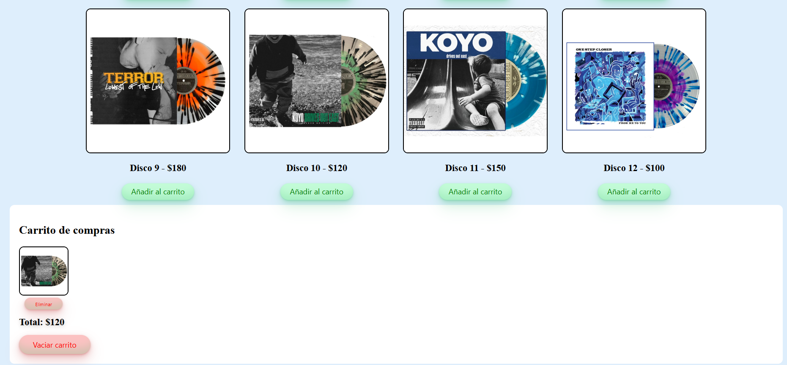

# 🛒 Venta de discos LP

## Descripción  
Este proyecto es un ejercicio sencillo de aplicación web que simula un carrito de compras de discos LP.  

### 🎯 **Objetivos de la aplicación**
- Visualizar una lista de productos disponibles.
- Agregar productos al carrito.
- Eliminar productos del carrito.
- Calcular y mostrar en tiempo real el total a pagar.

### 📸 **Vista previa de la aplicación**  

### 🛠 **Tecnologías utilizadas**
- **HTML** para la estructura de la página.
- **CSS** para el diseño y estilos.
- **JavaScript** para la funcionalidad del carrito de compras.

### 📌 **Funcionalidades**
✅ Lista de productos con imagen y precio.  
✅ Botón para añadir productos al carrito.  
✅ Visualización del carrito y total a pagar.  
✅ Posibilidad de eliminar o vaciar productos del carrito.  

[Ver la tarjeta de blog]()

## 📚 Fuentes y Referencias  
Las imágenes utilizadas en este proyecto fueron tomadas como referencia de la tienda en línea **Triple B Records**.  

📌 **Fuente de las imágenes:**  
🔗 **[Triple B Records](https://triplebrecords.net/)**  

ℹ️ **Nota:** Este proyecto es solo una práctica académica y no está afiliado ni relacionado con **Triple B Records**.  

